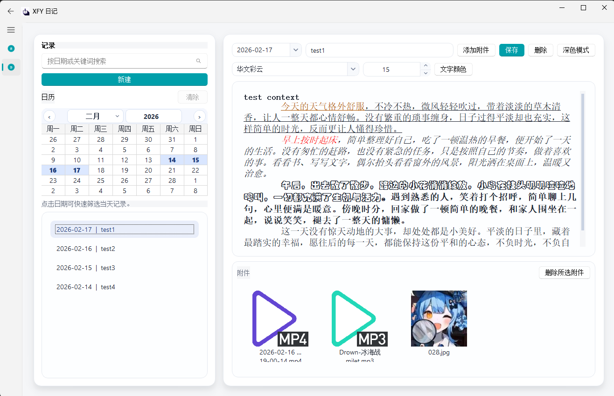
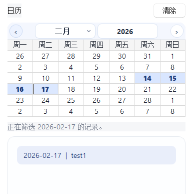
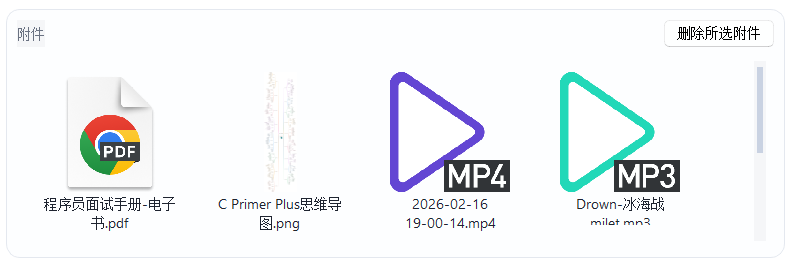
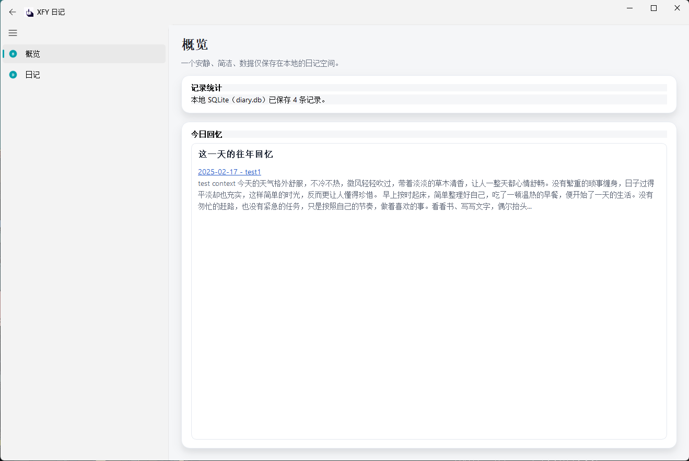
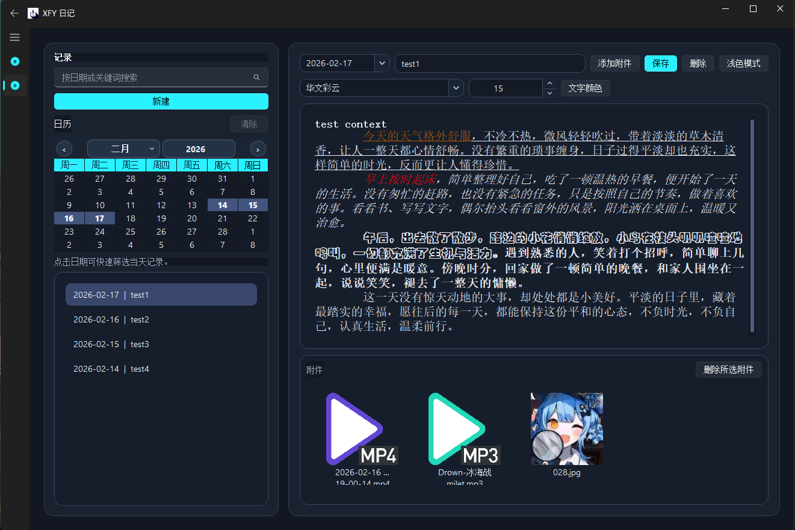

# XFY Diary（日记桌面应用）

一个基于 **PyQt5 + PyQt-Fluent-Widgets** 的本地日记软件，界面简洁，数据默认仅保存在本机。

## 软件直链下载

- 百度网盘（含提取码）：https://pan.baidu.com/s/1WaNjSq1on2bR9OdKdI2DHg?pwd=si9w

## 创作者

- B 站账号（小肥霙）：https://space.bilibili.com/452714637?spm_id_from=333.788.0.0
- 大一学生使用codex制作，技术力不足请见谅

## 项目功能

- **日记管理**：新建、编辑、保存、删除，支持多选后批量删除。
- **搜索与筛选**：可按日期或关键词搜索；点击日历日期可快速筛选当天记录。
- **富文本编辑**：支持加粗、斜体、下划线、字体、字号、文字颜色。
- **附件能力**：支持图片/文档/音视频等附件；图片显示缩略图，双击可打开。
- **概览与回忆**：概览页显示总记录数，并展示“今日回忆”（往年同日记录，可跳转）。
- **主题切换**：支持浅色/深色模式。
- **本地存储**：核心数据为 `diary.db` + `attachments/`，不依赖云端。

## 界面截图

### 1) 主界面总览


### 2) 日历筛选


### 3) 富文本编辑


### 4) 附件区域


### 5) 今日回忆


### 6) 深色模式


## 快捷键

| 快捷键 | 功能 | 生效范围 |
| --- | --- | --- |
| `Ctrl + S` | 保存当前日记 | 窗口内 |
| `Ctrl + B` | 加粗 | 编辑器 |
| `Ctrl + I` | 斜体 | 编辑器 |
| `Ctrl + U` | 下划线 | 编辑器 |
| `Delete` | 删除当前选中记录 | 左侧记录列表 |
| `Enter / Return` | 确认部分弹窗操作 | 确认弹窗 |

## 项目构成

| 路径 | 说明 |
| --- | --- |
| `main.py` | 主程序入口与核心逻辑（UI、数据库、附件、主题、页面切换） |
| `requirements.txt` | 运行依赖（`PyQt5`、`PyQt-Fluent-Widgets`） |
| `diary.db` | 本地 SQLite 数据库（运行后生成/使用） |
| `attachments/` | 日记附件目录（运行时维护） |
| `icons/` | 界面图标资源 |
| `logo_done.png` / `logo_done.ico` | 应用图标资源 |
| `XFYDiary.spec` | PyInstaller 打包配置 |
| `installer/XFYDiaryInstaller.nsi` | NSIS 安装包脚本 |
| `build/`、`dist/`、`release/` | 打包中间产物、可运行产物、发布产物 |
| `AGENTS.md` | 仓库协作与开发规范说明 |

## 本地运行（开发）

```powershell
python -m venv .venv
.\.venv\Scripts\Activate.ps1
pip install -r requirements.txt
python main.py
```


